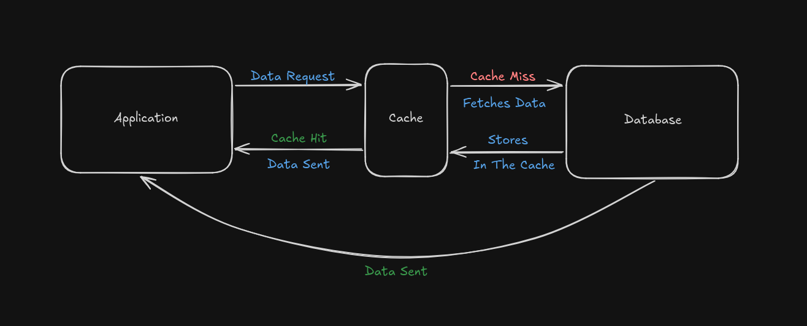

# cache-test
A Mini Test Repository To Understand Caching.

# Caching 
Caching is a technique to store a set of data temporarily in a storage location (**also called as the cache*) to access the data faster. Caching helps to access frequently requested data faster by storing it in a temporary storage location. 

# Strategy
There are various caching strategies (techniques). This mini test repository uses the **Cache-Aside** caching strategy. This section explains this technique in a high level.

## Breakdown
- Initially, the application requests for some data to the server.
- The server first checks for the data in the *cache*. If the data was found (typically called as `cache hit`), the data is returned to the client.
- If the data is not found in the cache (typicalled called as `cache-miss`), the server fetches the data from the database. The copy of this data is then stored in the cache for future requests. This fetched data is sent to the client.

 

# Testing

To test the latency and time taken, we will need to simulate multiple `user` and `concurrent` requests. To achieve this, we can use the `loadtest` package.

This is the latency and time taken **before** we cache the data:


This is the latency and time taken **after** we cache the data: 


As we can see, the mean latency dropped from `133.5`ms to `35.6`ms, which is a significant increase in performance. Similarly, the time taken dropped from `3.7`s to `0.5`ms which is about **7x** times faster than the time taken before caching.

# Custom Cache Implementation

This repository contains a basic implementation of an `in-memory` cache. The Cache class contains basic methods which is given below:

A Cache object can be created by instantiating the Cache class.
We pass in an **integer** as an argument to the constructor. This argument defines the *TTL (Time To Live)* of the cache in minutes, i.e how long the cache will store the data in-memory. 

```js
const cache = new Cache(10); // stores data in the cache for 10 minutes.
```


## Read Cache
```js
<CacheObject>.readCache()
```
*Checks if the cache is expired (or) if the cache is empty, if true, it returns **null***.
*Else, return the **cached** data.*

```js
// example usage
const cache = new Cache(10);
const cachedData = cache.readCache();

if (cachedData){
    // return the cached data.
} else{
    // fetch the data from the database and set the cache.
}
```

## Set Cache
```js
<CacheObject>.setCache(data)
```
*Sets/Stores the data in the cache (in-memory).*

```js
const cache = new Cache(10);
const cachedData = cache.readCache();

if (cachedData){
    // return the cached data.
} else{
    // fetch the data from the database and set the cache.
    // fetchedData is a variable that stores the data fetched from an 
    // external api or from a database
    cache.setCache(fetchedData); 
}
```

## Reset Cache
```js
<CacheObject>.resetCache()
```
*Resets/Clears the cache.*

```js
const cache = new Cache(10);
const cachedData = cache.readCache();

if (cachedData){
    // return the cached data.
} else{
    // fetch the data from the database and set the cache.
    // fetchedData is a variable that stores the data fetched from an 
    // external api or from a database
    cache.setCache(fetchedData); 
}

// clearing the cache
cache.resetCache();
```